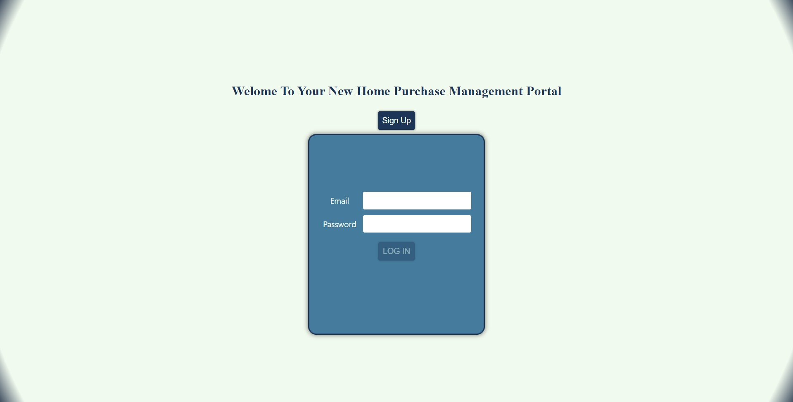
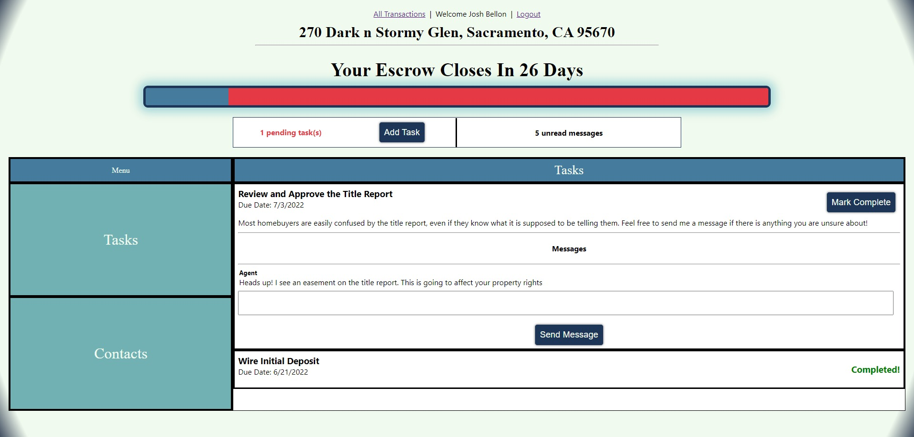

# Transaction Tracker by J.B.

Having a new house is fun.

Buying that new house isn't.

Introducing a new kind of Real Estate software.  Designed by the agent, for the client.

If there's one area that technology has yet to revolutionize the Real Estate industry, it's making the escrow process more transparent and manageable for the client.

The Transaction Tracker by J.B. is a proof-of-concept visualization of an idea that's long been brewing in the head of its creator - a one-stop portal for both agents and home-buyers to keep track of deadlines, pending tasks, and other essential particulars of the month-long tornado of activity that is the escrow process.

## GETTING STARTED

Click [HERE](https://transaction-tracker-by-jb.herokuapp.com/) to take the Transaction Tracker for a spin

Test Admin User -
email: testadmin@testadmin.com
pass: testadmin

Test User -email: test456@test456.com pass: test456

## SCREENSHOTS

## TECHNOLOGIES USED

- MongoDB / Atlas
- Express
- React
- Node.js
- Javascript
- HTML5
- CSS
- VS Code
- Heroku
- Github
- [whimsical.com](https://whimsical.com/transaction-tracker-T5xWzXHVaNj61DKSWs8JRV) (for wireframe project planning)
- [lucidchart.com](https://lucid.app/lucidchart/19c81991-1439-42e6-8feb-869f6df11e94/edit?invitationId=inv_da3484cd-5125-401d-a07c-2a682adf6ee4) (for data relationship planning)
- [GitHub Projects Board](https://github.com/jathos/Portfolio-Project-4___HomeBuyer-Transaction-Tracker/projects/1) (for user stories and task management)

## NEXT STEPS

- Enable PDF document upload and download
- Implement functionality for home sellers
- Separate admin views for different agents
- Mobile / Email alerts for new tasks and messages
- Automatic sorting and styling of tasks based on real world time
- Improve styling
- Responsive mobile friendly design

